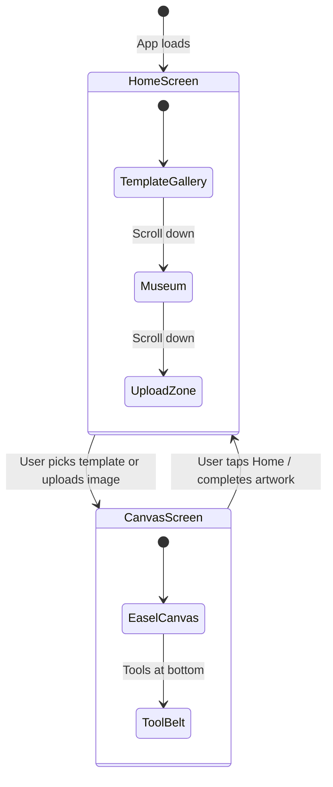

# Run and deploy your AI Studio app

This contains everything you need to run your app locally.

View your app in AI Studio: https://ai.studio/apps/b8ebfaa3-08e2-478b-9f35-a342a50151d6

## Run Locally

**Prerequisites:**  Node.js


1. Install dependencies:
   `npm install`
2. Set the `GEMINI_API_KEY` in [.env.local](.env.local) to your Gemini API key
3. Run the app:
   `npm run dev`


# 🎨 Coloring Canvas — Full Project Walkthrough

## Overview

**Coloring Canvas** is a kid-friendly, single-page coloring application built with React + TypeScript + Vite. It was originally created via **Google AI Studio** as an "applet" and is designed to let children paint on coloring-book-style outline images using freehand brushes and bucket-fill tools, with a physically realistic **subtractive (RYB) paint mixing** system.

> [!IMPORTANT]
> This is an entirely **client-side, offline-capable** app. There is no server/backend needed to run it — all drawing, color mixing, and persistence happens in the browser via Canvas 2D API and `localStorage`.

---

## Tech Stack

| Layer | Technology | Purpose |
|---|---|---|
| **Framework** | React 19 + TypeScript | Component model and type safety |
| **Build Tool** | Vite 6.2 | Dev server, HMR, bundling |
| **Styling** | TailwindCSS v4 (via `@tailwindcss/vite` plugin) | Utility-first CSS |
| **Icons** | Lucide React | SVG icon library (imported but mostly emoji-based UI) |
| **Animations** | `motion` (Framer Motion) | Animation library (listed as dependency) |
| **Font** | Inter + JetBrains Mono (Google Fonts) | Typography |
| **AI Integration** | `@google/genai` SDK | Listed as dependency for Gemini API (not actively used in current code) |
| **Sound** | Web Audio API (custom `SoundSynth` class) | Procedural sound effects |

---

## File Structure

```
coloring-canvas-demo2/
├── index.html                     # HTML shell
├── package.json                   # Dependencies and scripts
├── vite.config.ts                 # Vite + Tailwind + React plugins
├── tsconfig.json                  # TypeScript config
├── metadata.json                  # AI Studio app metadata
├── .env.example                   # Env vars (GEMINI_API_KEY, APP_URL)
├── assets/.aistudio/              # AI Studio internal config
└── src/
    ├── main.tsx                   # React entry point
    ├── App.tsx                    # ★ Entire app in one component (~1530 lines)
    ├── index.css                  # Global styles, animations, Tailwind import
    ├── custom.d.ts                # TypeScript module declarations for images
    └── assets/images/
        ├── coloring_mushrooms_*.png   # Template: mushroom forest
        ├── coloring_space_*.png       # Template: astro-cat in space
        ├── coloring_sunflowers_*.png  # Template: cheerful sunflowers
        └── coloring_fruits_*.png      # Template: fruits paradise
```

---

## Architecture — Single Component Design

The entire application lives in **one file**: [App.tsx](file:///c:/Users/Tuvshin-PC/Desktop/coloring-canvas-demo2/src/App.tsx). There are no separate components, hooks, or utilities extracted — everything is co-located. The component manages two primary views:



---

## Feature-by-Feature Breakdown

### 1. 📚 Template Gallery (Home Screen)

**Location**: [App.tsx:L28-L61](file:///c:/Users/Tuvshin-PC/Desktop/coloring-canvas-demo2/src/App.tsx#L28-L61) (data), [App.tsx:L1049-L1114](file:///c:/Users/Tuvshin-PC/Desktop/coloring-canvas-demo2/src/App.tsx#L1049-L1114) (UI)

Four pre-bundled coloring page templates displayed on a "wooden bookshelf":

| Template | Emoji | Description |
|---|---|---|
| Happy Mushroom Forest | 🍄 | Forest mushrooms and ladybug |
| Astro-Cat Adventure | 🐱🚀 | Cat in space with rocket |
| Cheerful Sunflowers | 🌻 | Smiling flowers under rainbow |
| Sweet Fruits Paradise | 🍉🍓 | Watermelon, pear, apple & stars |

Each card shows:
- The outline image preview
- A "Draft Saved!" overlay if the user has an in-progress version
- "Start Page ✨" or "Continue 🎨" + "🧹 Reset" buttons

---

### 2. 🖌️ Freehand Brush Drawing

**Location**: [App.tsx:L826-L900](file:///c:/Users/Tuvshin-PC/Desktop/coloring-canvas-demo2/src/App.tsx#L826-L900)

Uses the HTML5 Canvas 2D API with `PointerEvent` handlers for cross-device (mouse + touch + stylus) support:

- **`startDrawing`** — On pointer down, captures a history snapshot, begins a new stroke path
- **`draw`** — On pointer move, draws line segments between consecutive positions
- **`stopDrawing`** — On pointer up/leave, ends drawing and auto-saves progress
- **Pointer capture** — `setPointerCapture()` ensures strokes continue even if the pointer leaves the canvas bounds
- **Brush size** — Adjustable via slider (4px–44px), with a live color+size preview dot

---

### 3. 🪣 Animated Flood Fill (Paint Bucket)

**Location**: [App.tsx:L592-L746](file:///c:/Users/Tuvshin-PC/Desktop/coloring-canvas-demo2/src/App.tsx#L592-L746)

This is the most complex algorithm in the project. When the bucket tool is active and the user taps:

1. **BFS Flood Fill** — Scans outward from the tap point, collecting all pixels within a color `tolerance` of 48
2. **Subtractive Color Blending** — The fill color is computed by blending the existing region color with the selected paint color using the RYB model (not just replacing it)
3. **Organic Shape Noise** — Each pixel's distance from center is perturbed with multi-frequency sinusoidal noise to simulate watercolor paper capillary action:
   ```
   noise = sin(angle * 7) * 18 + cos(angle * 12) * 9 + sin(angle * 3.5) * 24 + sin(x * 0.12) * cos(y * 0.12) * 6
   ```
4. **Animated Spread** — Pixels are sorted into 35 concentric distance buckets and painted frame-by-frame via `requestAnimationFrame`, creating a "water spreading outward" visual effect

---

### 4. 🎨 Subtractive RYB Color Mixing System

**Location**: [App.tsx:L196-L318](file:///c:/Users/Tuvshin-PC/Desktop/coloring-canvas-demo2/src/App.tsx#L196-L318) (math), [App.tsx:L504-L581](file:///c:/Users/Tuvshin-PC/Desktop/coloring-canvas-demo2/src/App.tsx#L504-L581) (mixing pot)

This is the scientific heart of the app. Instead of standard RGB additive mixing (where red + blue = magenta), this uses **subtractive RYB mixing** — how real paint works:

| Mix | Result |
|---|---|
| Red + Yellow | Orange |
| Red + Blue | Violet/Purple |
| Yellow + Blue | Green |
| Red + Yellow + Blue | Dark Brown/Muddy |

#### The Algorithm

1. **`rgbToRyb()`** — Converts RGB screen colors to the RYB color space by extracting white, computing yellow from red+green overlap, and normalizing
2. **`rybToRgb()`** — Converts back using **tri-linear interpolation** across an 8-vertex RYB cube with fixed color endpoints:
   - Pure R → `#ef4444` (Red)
   - Pure Y → `#facc15` (Yellow)
   - Pure B → `#2563eb` (Blue)
   - R+Y → `#f97316` (Orange)
   - Y+B → `#16a34a` (Green)
   - R+B → `#8b5cf6` (Violet)
   - R+Y+B → `#413732` (Dark brown)
3. **`blendPhysicalColors()`** — Blends two hex colors in RYB space with a configurable ratio. Smart enough to skip blending on white paper or black outlines (paints directly instead)

#### The Mixing Pot UI

Five paint "drops" can be added to a virtual cauldron:
- 🔴 Red, 🟡 Yellow, 🔵 Blue, ⬜ White, ⬛ Black
- White acts as a **tint** (lightener), Black as a **shade** (darkener)
- The pot shows animated liquid with individual paint drop particles visible before stirring
- A "🥄 Stir" button triggers spin animation + bubble sounds
- A "🧼 Wash" button resets the pot
- The mixed color is **automatically set as the active painting color**

---

### 5. 🔊 Procedural Sound Design (`SoundSynth`)

**Location**: [App.tsx:L63-L183](file:///c:/Users/Tuvshin-PC/Desktop/coloring-canvas-demo2/src/App.tsx#L63-L183)

A custom synthesizer class using the Web Audio API — **no audio files needed**. All sounds are generated programmatically:

| Sound | Trigger | Technique |
|---|---|---|
| `playDrop()` | Brush stroke start, paint drop added | Triangle wave, 140→35 Hz exponential ramp (0.12s) |
| `playBubble()` | Stirring paint pot | Sine wave, random 220-600 Hz → 2.1x frequency (0.08s) |
| `playSplash()` | Bucket fill | 4 overlapping sine waves with ascending frequencies (0.25s) |
| `playChime()` | Image loaded, masterpiece saved, correct parental answer | C major arpeggio (C4→E4→G4→C5) on triangle waves |
| `playSquish()` | UI button interactions | Triangle wave, 160→75 Hz ramp (0.07s) |

Also uses `navigator.vibrate()` for haptic feedback on mobile devices.

---

### 6. 💾 Persistence (localStorage)

**Location**: [App.tsx:L339-L502](file:///c:/Users/Tuvshin-PC/Desktop/coloring-canvas-demo2/src/App.tsx#L339-L502)

| Key | Purpose |
|---|---|
| `coloring_inprogress_{templateId}` | Auto-saves canvas as data URL after each stroke or fill — allows "Continue" later |
| `coloring_inprogress_custom` | Same but for user-uploaded custom images |
| `coloring_museum_completed` | JSON array of completed artworks (id, src data URL, title, timestamp) |

- **In-progress drafts** are shown as overlays on gallery cards with "Draft Saved!" badges
- **Completed masterpieces** appear in the "Art Museum" section with gold-framed gallery presentation

---

### 7. 🏛️ Art Museum / Gallery

**Location**: [App.tsx:L1116-L1171](file:///c:/Users/Tuvshin-PC/Desktop/coloring-canvas-demo2/src/App.tsx#L1116-L1171)

When the user taps "🌟 Done! 🖼️" on the canvas, the current drawing is:
1. Saved as a completed masterpiece to localStorage
2. In-progress draft is cleared
3. The home screen shows it in a **gold-framed gallery wall** with:
   - Gold border (`#d4af37`) simulating a physical frame
   - Corner brass hanger dots
   - A name plaque at the bottom
   - Delete button (❌) on each frame

---

### 8. 🧐 Parental Gate (Math Puzzle Lock)

**Location**: [App.tsx:L380-L438](file:///c:/Users/Tuvshin-PC/Desktop/coloring-canvas-demo2/src/App.tsx#L380-L438), [App.tsx:L1472-L1519](file:///c:/Users/Tuvshin-PC/Desktop/coloring-canvas-demo2/src/App.tsx#L1472-L1519)

Certain actions are protected behind an arithmetic puzzle to prevent kids from accidentally triggering them:

**Protected actions**:
- Uploading custom images (file picker)
- Clearing the canvas (🧹)
- Downloading/saving to device (📥)

**How it works**:
1. Generates a random multiplication or addition problem (e.g., `7 × 5 = ?`)
2. Shows 4 multiple-choice bubble answers (1 correct, 3 distractors ±4 of the answer)
3. Correct answer → action executes + chime sound
4. Wrong answer → alert + regenerated puzzle

---

### 9. ↩️ Undo History

**Location**: [App.tsx:L902-L921](file:///c:/Users/Tuvshin-PC/Desktop/coloring-canvas-demo2/src/App.tsx#L902-L921)

- Maintains a stack of up to **20 canvas snapshots** (as data URLs)
- Each brush stroke or bucket fill pushes a snapshot *before* the operation
- Undo pops the last snapshot and redraws the canvas
- The undo button shows a pink badge with the current history depth

---

### 10. 📂 Custom Image Upload

**Location**: [App.tsx:L748-L786](file:///c:/Users/Tuvshin-PC/Desktop/coloring-canvas-demo2/src/App.tsx#L748-L786)

- Supports PNG, JPG, WEBP, GIF
- Drag-and-drop with animated dashed border
- Protected by the parental gate
- Sets `currentTemplateId` to `"custom"` for separate draft persistence

---

## UI / UX Design Philosophy

The entire UI is designed with a **kid-friendly playroom aesthetic**:

- **Wooden bookshelf** for template gallery (`bg-[#e5d4bc]` with border shadows)
- **Museum wall** in warm brown (`bg-[#8a5a3c]`) for completed art
- **Easel canvas** in dark teal (`bg-[#2c3e50]`) with cherry wood border (`border-[#8e4a23]`)
- **Tool belt** styled as a wooden table surface
- Emoji-heavy interface (no text labels on most tools)
- **Squishy physics** — `active:scale-90`, `hover:scale-105`, `active:rotate-3` on buttons
- **Zero-text** tool buttons — tools are identified by emojis (🖌️ 🪣 ↩️ 🧹 📥)
- Background decorative blur blobs (`blur-[80px]`) for warmth

---

## Key State Variables

| State | Type | Purpose |
|---|---|---|
| `imageLoaded` | `boolean` | Controls Home vs Canvas screen |
| `imageDataUrl` | `string` | Current loaded image as data URL |
| `selectedColor` | `string` | Active paint color (hex) |
| `brushSize` | `number` | Brush diameter (4–44px) |
| `history` | `string[]` | Undo stack (max 20 data URLs) |
| `activeTool` | `'brush' \| 'bucket'` | Current tool mode |
| `currentTemplateId` | `string` | Which template is being edited |
| `completedArtworks` | `Array` | Museum gallery items |
| `inProgressMap` | `Record<string, string>` | Draft data URLs keyed by template ID |
| `mixPot` | `{r,y,b,w,k}` | Paint drop counts in mixing cauldron |
| `isStirring` | `boolean` | Stirring animation active |
| `parentGateOpen` | `boolean` | Math puzzle modal visible |

---

## CSS Highlights ([index.css](file:///c:/Users/Tuvshin-PC/Desktop/coloring-canvas-demo2/src/index.css))

- **`animated-dash-border`** — Animated marching-ants border for the upload zone using four gradient backgrounds that shift position via `border-dance` keyframes
- **`.canvas-paint-area`** — Disables `touch-action` and `user-select` to prevent browser gestures from interfering with drawing
- **`.glass-panel`** — Glassmorphism utility with `backdrop-filter: blur(12px)`

---

## Unused / Dormant Dependencies

| Dependency | Status |
|---|---|
| `@google/genai` | Imported in `package.json` but **not used** in `App.tsx` — likely placeholder for future AI-powered features (e.g., auto-generate coloring pages) |
| `express` + `dotenv` | Server-side dependencies, probably from the AI Studio scaffold — **not used** in the current client-only app |
| `motion` (Framer Motion) | Listed but **not imported** in `App.tsx` — animations are done with CSS transitions |
| `lucide-react` | Imported at the top of `App.tsx` but **icons are not used** — the UI uses emojis instead |

---

## How to Run

```bash
cd coloring-canvas-demo2
npm install
npm run dev          # Starts Vite dev server on port 3000
```

> [!NOTE]
> The app is **already running** in your terminal (`npm run dev` for 5+ hours on port 3000).

---

## Summary

This is a **feature-rich, kid-safe digital coloring app** with several standout engineering decisions:

1. **Real paint physics** — Subtractive RYB color mixing with tri-linear interpolation, not toy RGB blending
2. **Organic flood fill** — Multi-harmonic noise distortion creates natural watercolor spread patterns
3. **Zero-dependency audio** — All sounds synthesized at runtime via Web Audio API oscillators
4. **Parental controls** — Arithmetic puzzle gate protects destructive/external actions
5. **Full persistence** — Drafts and completed art saved to localStorage, surviving page reloads
6. **Monolithic architecture** — The entire 1530-line app lives in a single `App.tsx` file with no component extraction
